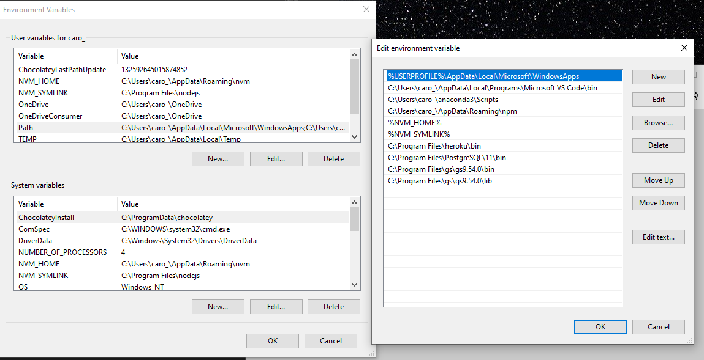

# pdf_extract

This repository is to extract tabular data from PDF using the camelot library.

To install camelot:
1) Install Ghostscript. Link: 
https://www.ghostscript.com/download/gsdnld.html

```
pip install ghostscript
```
Make sure that the Ghostscript bin and lib Paths are added to windows user variables


2) pip install camelot
```
pip install camelot-py[cv]
```
Video how to extract data with camelot by Frank Du
https://www.youtube.com/watch?v=LoiHI-IB3lY
